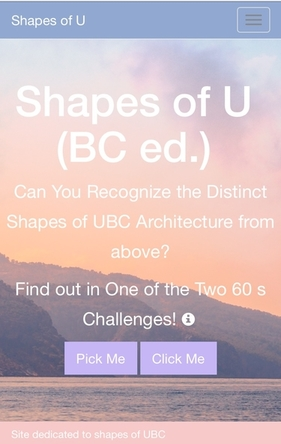
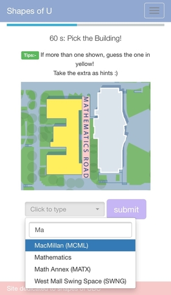
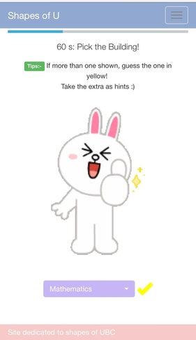
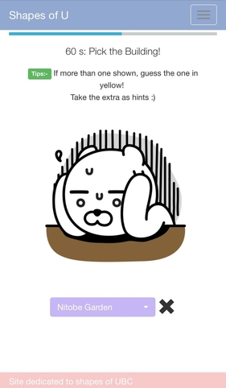
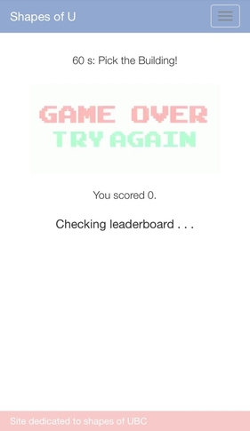
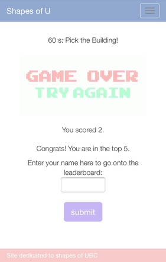
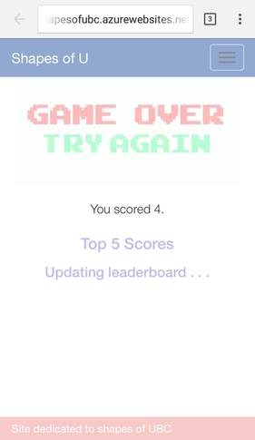
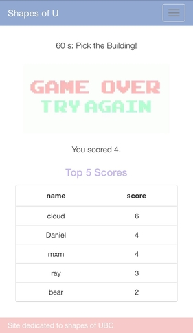
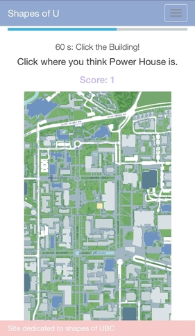

# Shapes of UBC

- a mobile-friendly website for two 60-second quiz-like games devoted to the shapes of UBC archetecture from above
- Hosted on Microsoft Azure (on a free trial) with a node.js backend for leaderboard operations

#### Mobile Screeshots
</img>
</img>
</img> 
</img>
</img>
</img> 
</img>
</img>
</img>
